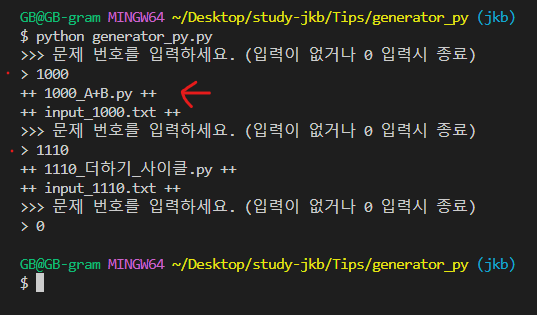
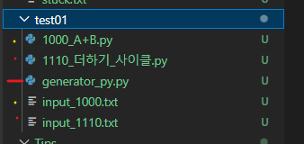
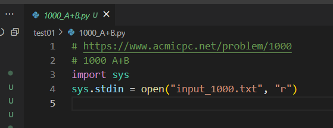
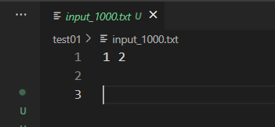
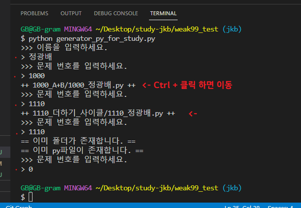
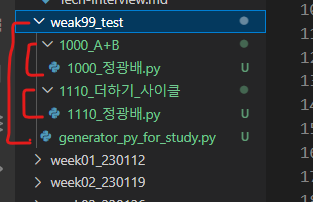
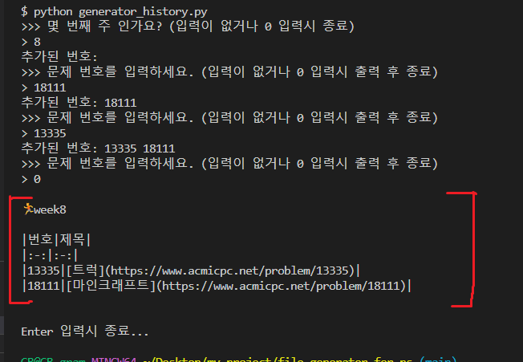

# py파일 생성기

## py_generator.py

* 수정 내역

  * 20230312

    * refactoring: 커스터마이징을 더 쉽게

  * 20230413

    * input text가 어색하게 write되는 현상 수정

        * `.replace('\r', '')` 추가

* 개인이 문제를 풀때 py파일과 입력예시를 가져오기 위한 generator입니다.

* 파일 이름이나 내용을 커스텀하셔도 됩니다.

* 자신이 문제푸는 폴더에서 실행해주세요.

* 터미널

* 생성 파일 목록

* py파일

* input.txt 파일

## for_study.py

* 수정 내역

  * 2.0 : 날짜를 계산하여 week폴더도 자동으로 생성.

* 스터디 폴더를 만들기 위한 generator입니다.

* '문제번호_이름.py'파일을 자동으로 만들어줍니다.

* `name` 부분을 자신의 이름으로 하드코딩으로 사용하셔도 됩니다.

* 파일 실행 위치:
  * 1.0: week 폴더 안에서
  * 2.0: 스터디 폴더에서

* 터미널

* 생성 파일 목록

## generator_history.py

* 스터디 history를 위한 text generator

* 출력된 부분 복사