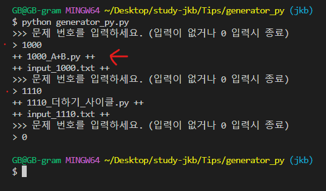
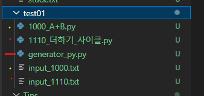
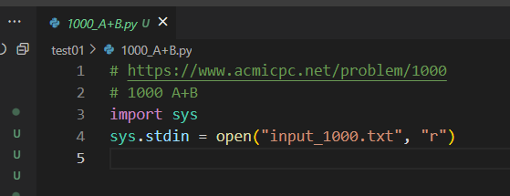
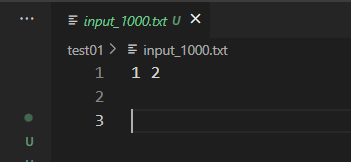
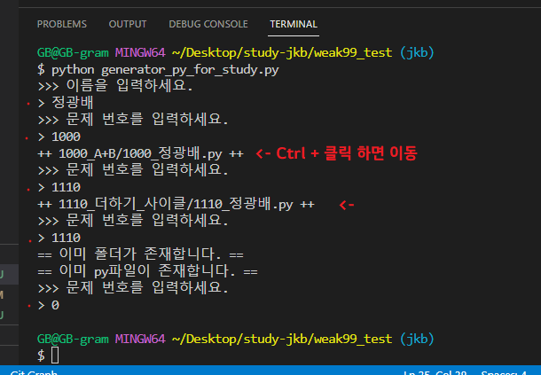
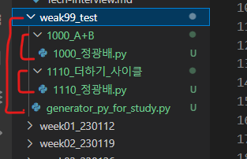

# py파일 생성기
> ~~그냥 타자치기 귀찮아서 만들었습니다.~~

## generator_py.py

* 개인이 문제를 풀때 py파일과 입력예시를 가져오기 위한 generator입니다.

* 파일 이름이나 내용을 커스텀하셔도 됩니다.

* 자신이 문제푸는 폴더에서 실행해주세요.

* 터미널

* 생성 파일 목록

* py파일

* input.txt 파일

## generator_py_for_study.py

* 스터디 폴더를 만들기 위한 generator입니다.

* '문제번호_이름.py'파일을 자동으로 만들어줍니다.

* `name` 부분을 자신의 이름으로 하드코딩으로 사용하셔도 됩니다.

* 해당 week폴더 안에서 파일을 실행해 주세요.

* 터미널

* 생성 파일 목록

> PR 환영합니다😊